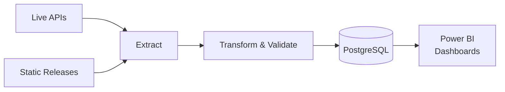

# Yorkshire Vitality Observatory — Data Pipeline

[](https://github.com/yhoda-project/YHODA/actions/workflows/ci.yml)
[](https://yhoda-project.github.io/YHODA)
[](https://www.python.org/downloads/)
[](https://www.prefect.io/)
[](https://github.com/astral-sh/ruff)
[](LICENSE)

An automated end-to-end Prefect v3 ETL pipeline that ingests, transforms, and warehouses socioeconomic, health, and environmental indicators for Yorkshire into PostgreSQL, powering the [Yorkshire Vitality Suite](https://yorkshireportal.org/vitality-suite) dashboards.

---

## Documentation

Full documentation is at **[yhoda-project.github.io/YHODA](https://yhoda-project.github.io/YHODA)**, including:

- [Onboarding](https://yhoda-project.github.io/YHODA/onboarding/) - get set up on the pipeline
- [Architecture](https://yhoda-project.github.io/YHODA/architecture/overview/) - how the system works
- [Runbooks](https://yhoda-project.github.io/YHODA/runbooks/) - what to do when something goes wrong
- [Reference](https://yhoda-project.github.io/YHODA/reference/environment-variables/) - environment variables, ERD, glossary

---

## Overview



---

## Quickstart

### Prerequisites

- Python 3.11+
- [`uv`](https://github.com/astral-sh/uv) package manager
- PostgreSQL 14+ with the target database created
- Self-hosted Prefect v3 server

### Install

```bash
git clone https://github.com/yhoda-project/YHODA.git
cd YHODA
uv sync --extra dev
cp .env.example .env  # then fill in DATABASE_URL and DWP_API_KEY at minimum
```

### Initialise the database

```bash
uv run alembic upgrade head
uv run python -m yhovi_pipeline.utils.seed_geo_lookup
uv run python -m yhovi_pipeline.utils.load_csv
uv run python -m yhovi_pipeline.utils.load_jobs
uv run python -m yhovi_pipeline.utils.load_industry
uv run python -m yhovi_pipeline.utils.load_neighbourhoods
```

### Register deployments and verify

```bash
uv run prefect deploy --all --no-prompt
uv run python -c "from yhovi_pipeline.config import get_settings; print('ok')"
uv run pytest
```

---

## Development

```bash
uv run ruff check --fix src/ tests/   # lint
uv run ruff format src/ tests/        # format
uv run mypy src/                      # type check
uv run pytest --cov=src/yhovi_pipeline  # tests with coverage
```

Unit tests require env vars but no real database:

```bash
export DATABASE_URL="postgresql+psycopg2://t:t@localhost/d"
export DWP_API_KEY="x"
uv run pytest tests/unit/
```

Pre-commit hooks (ruff, mypy, file hygiene) run automatically on every commit. Install them once with:

```bash
uv run pre-commit install
```

CI runs on every push and pull request. Deployments to Prefect are triggered automatically on merge to `main`.

---

## Project Structure

```
src/yhovi_pipeline/
├── config.py          # pydantic-settings; always use get_settings()
├── db/                # SQLAlchemy models + Alembic migrations
├── flows/             # 15 Prefect flows across economy/, society/, environment/
├── tasks/
│   ├── extract/       # one module per source (nomis, fingertips, dwp, ons, ...)
│   ├── transform/     # validate, normalise, geo
│   └── load/          # upsert_indicators, write_metadata
└── utils/             # CSV loaders, geo lookup, email alerts
```

---

## Licence

See [LICENSE](LICENSE).
