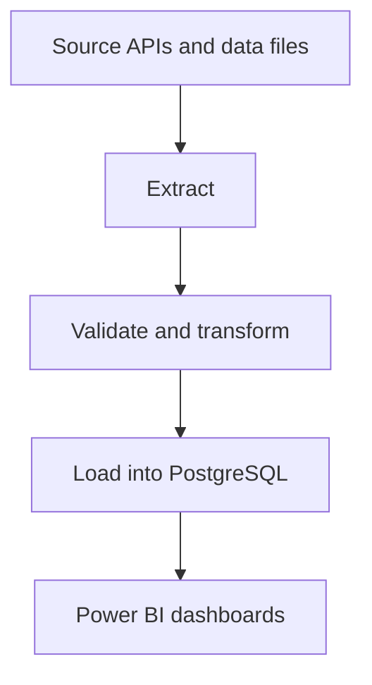

# System Overview

The YHODA pipeline is an automated data collection system that enables for the collection, transformation and loading
of Yorkshire indicator datasets.

---

## What it does

Once a month, the pipeline:

1. Connects to data sources (government APIs and statistical publications)
2. Downloads the latest figures for all 22 Yorkshire Local Authority Districts
3. Validates the data and transforms it into a consistent format
4. Stores the results in a central (Postgres) database
5. Records a log entry for each dataset - how many rows were loaded, when, and whether it succeeded

The database then feeds directly into the Yorkshire Vitality Suite dashboards in Power BI, which YHODA researchers and stakeholders use to explore the data.

---

## Where it runs

The pipeline runs on two virtual machines (VMs) hosted by the University of Sheffield:

| VM | Purpose |
|----|---------|
| `yhoda-staging.shef.ac.uk` | Development and testing |
| `yhoda-prod.shef.ac.uk` | Live, scheduled runs |

Both VMs are only accessible via the University of Sheffield VPN.

---

## How the pieces fit together

The pipeline is split into three stages:

1. Extract - connect to a data source and download the raw data
2. Transform - check it is complete and correct, then reshape it into a standard format
3. Load - write the results to the database

Each monthly dataset is handled by its own flow - a self-contained script that runs through all three stages for one domain. See [Pipeline](pipeline.md) for the full list of flows.

---

## What happens when it fails

If a flow fails, the pipeline:

1. Retries automatically after five minutes
2. Sends an email alert to the configured address
3. Records the failure in the `dataset_metadata` log table

The existing data in the database is not affected - a failed run simply means that month's update was not applied. See [Runbooks](../runbooks/index.md) for what to do when a flow fails.
