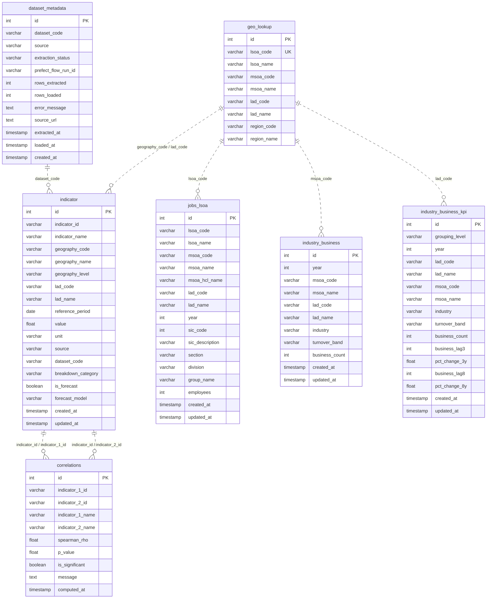

# Entity Relationship Diagram

This diagram shows the seven tables in the YHODA database and how they relate to each other.

The `geo_lookup` table is the geography dimension - it links the other tables via geography codes. The `dataset_metadata` table links to `indicator` via the `dataset_code` field, allowing any indicator row to be traced back to the pipeline run that loaded it.

---

